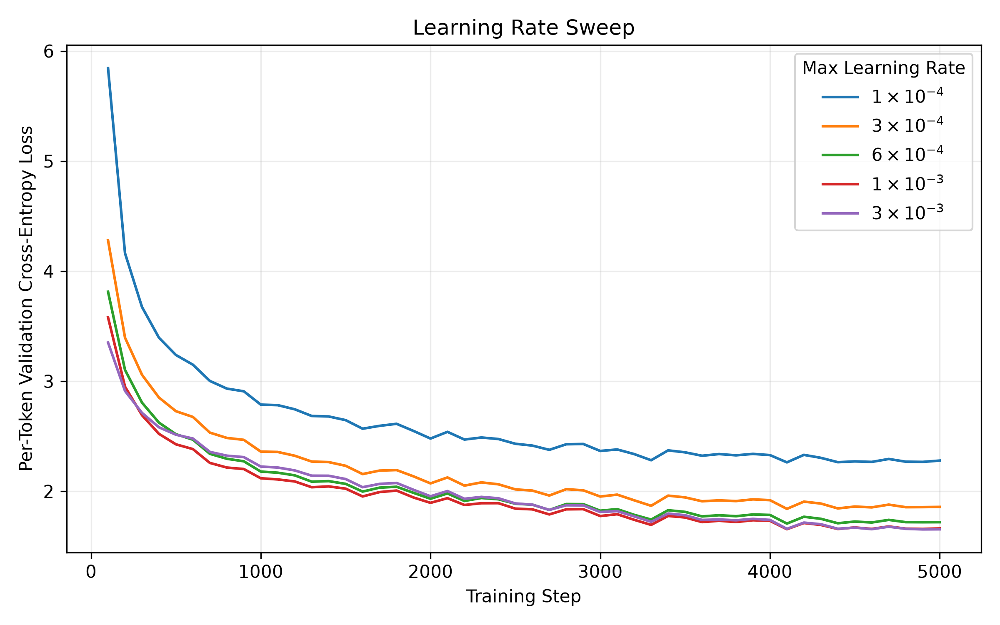
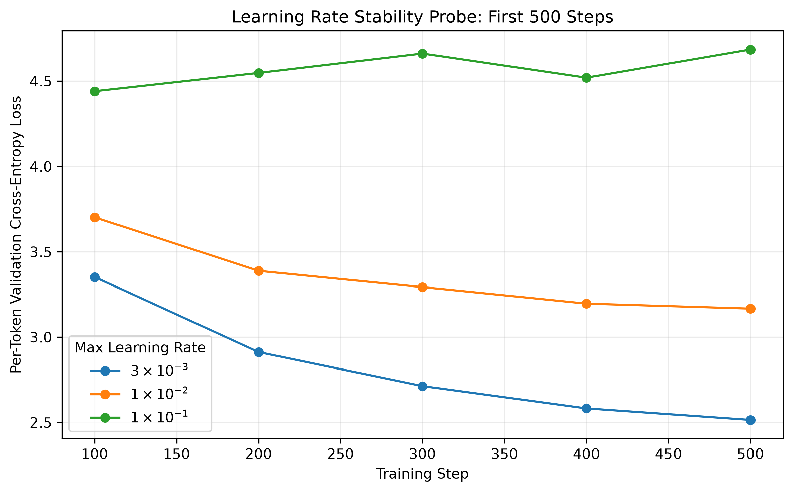
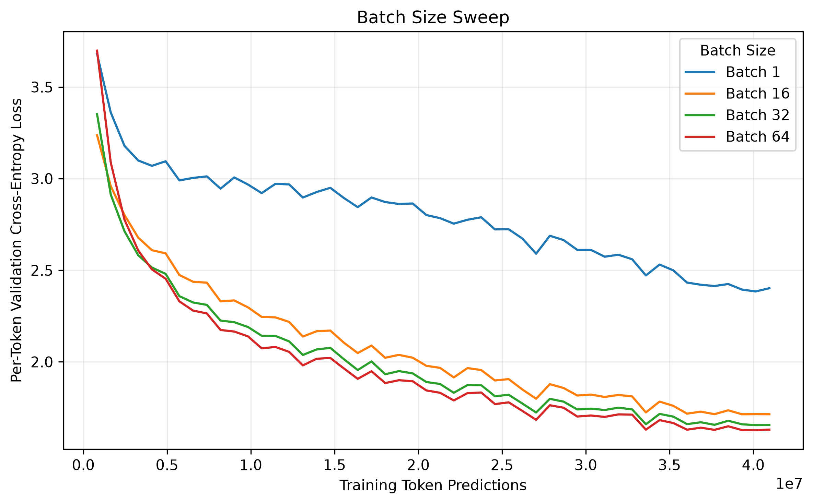
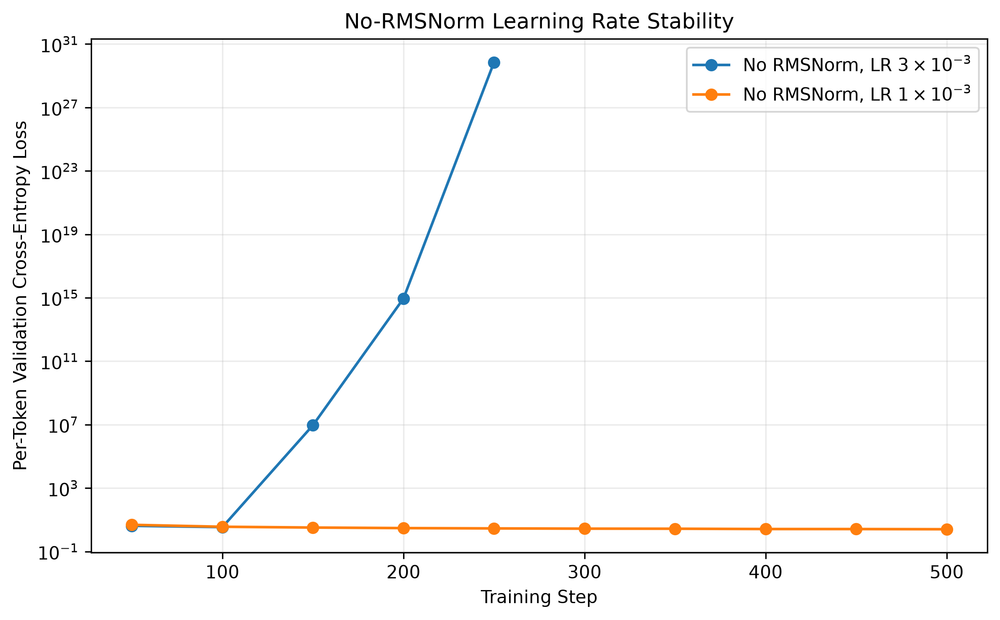
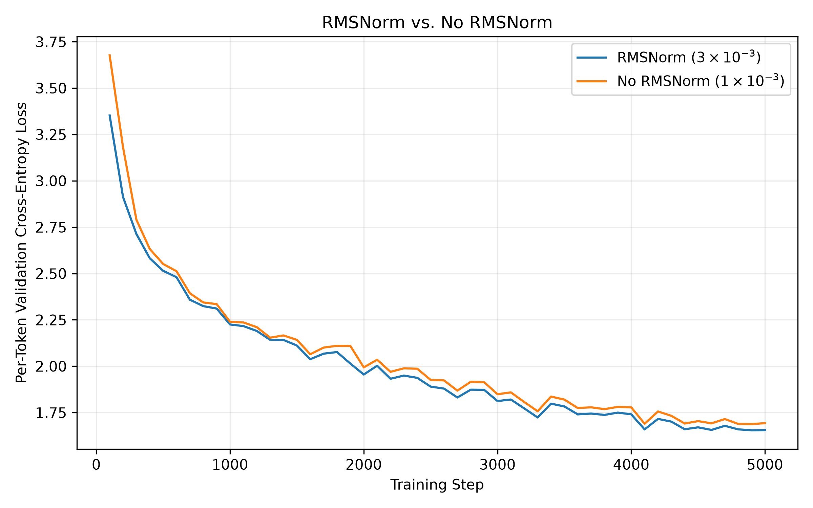
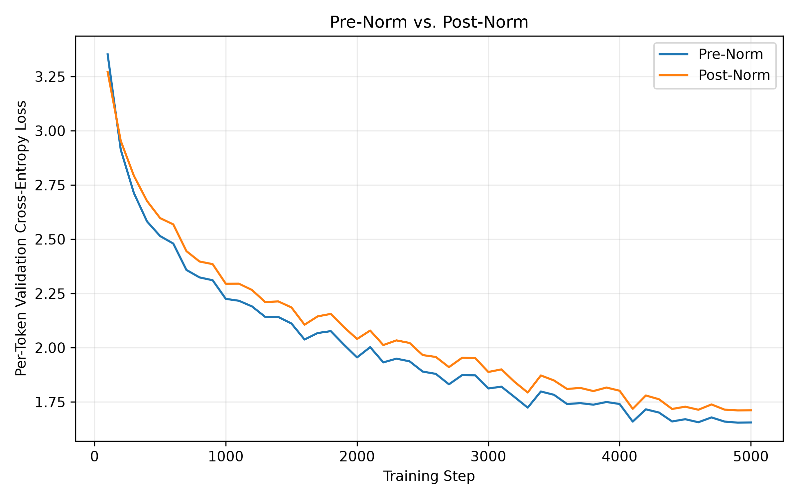
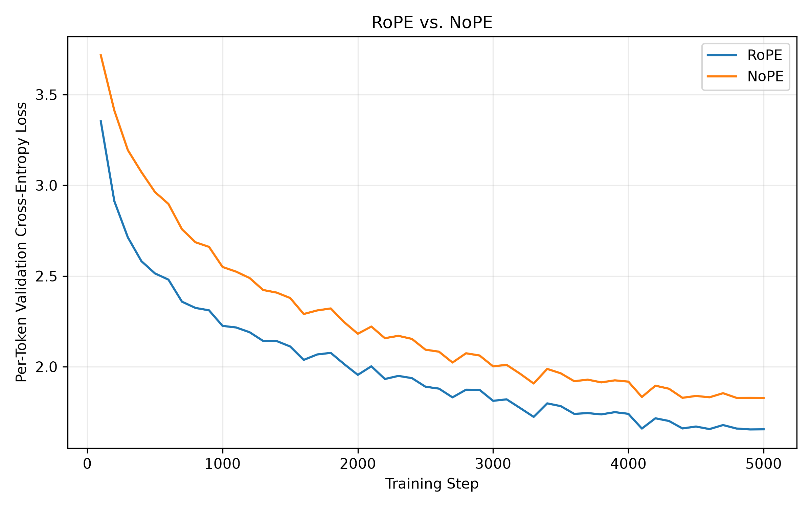
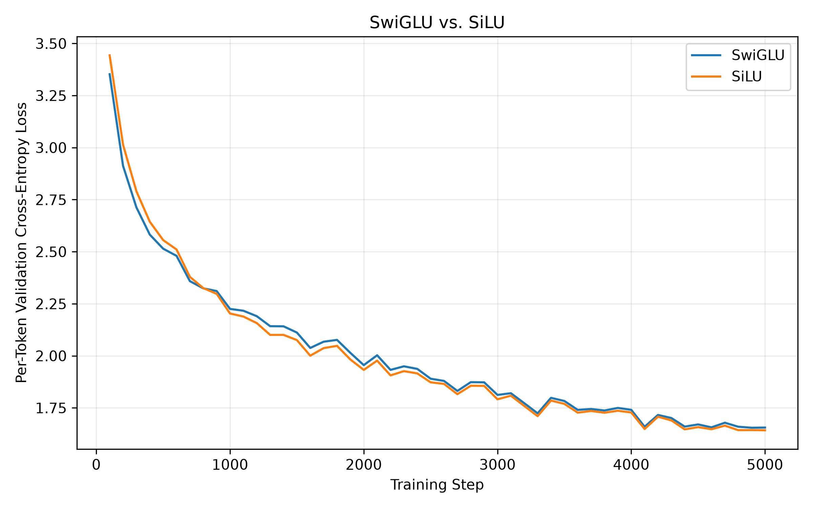

# StoryLM experiments

These experiments investigate how optimization and architecture choices affect a small language model trained under a fixed compute budget. The selected model uses batch size 64, pre-norm RMSNorm, RoPE, and SwiGLU, and achieved **1.6303 per-token validation cross-entropy** after **40,960,000 training token predictions**.

The measurements and qualitative observations below come from the original experiment report and saved project results. Lower validation cross-entropy is better. Results describe this model, dataset, budget, and tested configurations; they are not general rankings of Transformer architectures.

## Experimental setup

Training used the GPT-4 version of TinyStories V2, a byte-level BPE tokenizer with 10,000 tokens, and 256-token training sequences. The reference Transformer has four blocks, width 512, 16 attention heads, pre-norm RMSNorm, RoPE, and a SwiGLU feed-forward width of 1,344.

| Setting | Batch-32 reference |
| --- | --- |
| Training steps | 5,000 |
| Batch size | 32 |
| Token predictions per sequence | 256 |
| Total training token predictions | 40,960,000 |
| Seed | 42 |
| Optimizer | AdamW |
| Optimizer betas / epsilon | (0.9, 0.95) / 1e-8 |
| Weight decay | 0.1 |
| Gradient clipping | Maximum L2 norm 1.0 |
| Maximum / minimum learning rate | 0.003 / 0.0003 |
| Warmup | 100 steps, 2% of training |
| Schedule after warmup | Cosine decay through the final step |
| Validation | Every 100 steps, 10 batches |
| Original training device / precision | Apple MPS / float32 |

The token budget is the number of next-token predictions processed during training:

```text
batch size × sequence length × training steps
32 × 256 × 5,000 = 40,960,000
```

It is not a count of unique tokens in the dataset. Batch comparisons adjust training steps to preserve this budget. Larger batches therefore make fewer optimizer updates; equal token exposure does not mean equal update counts or wall-clock time.

The learning-rate sweep held architecture, data, random seed, optimizer settings, and schedule fixed while varying the maximum learning rate. Architecture comparisons use the batch-32 reference unless stated otherwise. The high-learning-rate probes below report losses at step 500 and should not be mistaken for completed 5,000-step runs.

## Learning rate: convergence before instability

I searched an approximately logarithmic range of maximum learning rates to find a useful operating point and investigate the transition toward instability.

| Maximum learning rate | Reported validation cross-entropy | Outcome |
| --- | ---: | --- |
| 0.0001 | 2.2793 | Stable, completed run |
| 0.0003 | 1.8586 | Stable, completed run |
| 0.0006 | 1.7199 | Stable, completed run |
| 0.001 | 1.6629 | Stable, completed run |
| **0.003** | **1.6554** | Stable, completed run; selected reference learning rate |
| 0.01 | 3.1669 at step 500 | Numerically stable, poor convergence in the probe |
| 0.1 | 4.6854 at step 500 | Unstable, non-convergent behavior in the probe |



*Completed learning-rate comparisons. Increasing the maximum learning rate helped up to 0.003, the best tested value.*

With AdamW beta2 fixed at 0.95 and a 100-step warmup, learning rates from 0.0001 through 0.003 remained stable. The lowest final validation loss was 1.6554 at 0.003, so I used that learning rate in the reference configuration for subsequent comparisons.



*Early stability probes distinguish an unhelpful but finite loss trajectory from unstable optimization.*

At 0.01, training remained numerically stable but improved much more slowly and had substantially worse validation loss. At 0.1, validation loss no longer showed sustained improvement. This separates the best tested learning rate from the point where optimization became unstable: a learning rate can be too large to work well before it produces numerical divergence.

These tests bracket useful and problematic settings; they do not locate an exact stability threshold or establish 0.003 as a universal optimum.

## Batch size: hold token exposure fixed

Before completing the batch sweep, I tested larger batches to find the practical memory limit. Batch size 128 immediately exhausted memory. Batch size 112 fit, but observed throughput suggested approximately two days for a full run on the original setup, so it was not a completed comparison.

| Batch size | Training steps | Training token predictions | Final validation cross-entropy |
| --- | ---: | ---: | ---: |
| 1 | 160,000 | 40,960,000 | 2.4020 |
| 16 | 10,000 | 40,960,000 | 1.7142 |
| 32 | 5,000 | 40,960,000 | 1.6554 |
| **64** | **2,500** | **40,960,000** | **1.6303** |



*Training steps decrease as batch size increases, keeping total token predictions fixed.*

Among completed runs, batch size 64 achieved the lowest final validation loss. Batch size 1 strongly underperformed despite making many more optimizer updates.

A plausible explanation is the noisier gradient estimate at batch size 1: each update uses one sequence, whereas larger batches average across more sequences. That interpretation is consistent with the learning curves, but the experiment does not isolate gradient noise as the only cause. Batch size also changes the number of updates and the schedule's duration in optimizer steps.

The selected checkpoint uses batch size 64 with SwiGLU. Its 2,500-step run uses 50 warmup steps, preserving the 2% warmup fraction, and evaluates every 50 steps with validation batch size 32. This was the best completed batch-size result, rather than the largest batch that could fit in memory.

## RMSNorm: a change in the stable learning-rate range

Removing all RMSNorm layers tests whether normalization is necessary for the reference model's optimization settings, and whether a smaller learning rate can recover stability.

| Configuration | Maximum learning rate | Outcome |
| --- | ---: | --- |
| Reference with RMSNorm | 0.003 | Stable; final validation cross-entropy 1.6554 |
| No RMSNorm | 0.003 | Diverged to NaN |
| No RMSNorm | 0.001 | Stable; final validation cross-entropy 1.6929 |



*The vertical axis is logarithmic. Removing normalization made the reference learning rate unstable.*

Without RMSNorm, loss increased rapidly and eventually became NaN at 0.003. Reducing the maximum learning rate to 0.001 restored stable training.

One possible mechanism is that removing normalization leaves hidden-state scales less controlled, making activations and gradients more sensitive to the learning rate. The loss trajectories establish instability and its recovery; they do not directly measure that mechanism.



*The stable no-RMSNorm run uses a lower learning rate than the reference.*

The stable ablation finished at 1.6929, compared with 1.6554 for the reference. In this setup, RMSNorm supported a larger stable learning rate and the better observed validation result. Because the stable comparison also changes learning rate, it is not an isolated measurement of normalization's effect at identical optimization settings.

## Pre-norm versus post-norm

I changed the Transformer from pre-norm to post-norm and compared the validation trajectories under the reference training settings.

| Normalization placement | Final validation cross-entropy |
| --- | ---: |
| Pre-norm | **1.6554** |
| Post-norm | 1.7116 |



*Post-norm converged more slowly and finished with higher validation loss.*

Post-norm remained worse through much of training and finished at 1.7116. The result supports retaining pre-norm for this configuration. It does not show that post-norm would remain worse after separately tuning its learning rate or schedule.

## RoPE versus NoPE

The NoPE variant removes explicit positional encoding while retaining the causal Transformer.

| Positional encoding | Final validation cross-entropy |
| --- | ---: |
| RoPE | **1.6554** |
| NoPE | 1.8284 |



*NoPE learned useful patterns, but its final validation loss remained higher than the RoPE reference.*

The NoPE model substantially reduced its loss, so explicit positional embeddings were not necessary for learning some useful structure. However, it finished at 1.8284 compared with 1.6554 for RoPE. The comparison supports using RoPE in the selected model; it does not imply that the causal NoPE architecture has no way to distinguish ordering.

## SwiGLU versus ungated SiLU

To compare feed-forward designs, I replaced SwiGLU with an ungated SiLU network:

```text
FFN_SiLU(x) = W2 · SiLU(W1 · x)
```

The SiLU variant uses a feed-forward width of 2,048, or four times the model width, to approximately match parameter counts.

| Feed-forward network | Hidden width | Final validation cross-entropy |
| --- | ---: | ---: |
| SwiGLU reference | 1,344 | 1.6554 |
| SiLU | 2,048 | **1.6424** |



*The two runs performed similarly, with a small final advantage for SiLU in this seed.*

SiLU finished slightly lower than SwiGLU, but only one random seed was evaluated. The difference is insufficient to conclude that SiLU is generally better. A batch-64/SiLU combination was not tested, so the selected checkpoint retains SwiGLU rather than combining independently promising settings without evidence.

## Generation: readable sentences, weaker narrative consistency

The reported generation used temperature **0.8** and nucleus sampling with **top-p 0.9**, with a maximum of 256 new tokens or an earlier end-of-text token.

**Prompt**

> Tom was a kid who liked to play with stuffed animal toys. However, one day his mom told him that he had to start studying more

**Reported output, including the prompt**

> Tom was a kid who liked to play with stuffed animal toys. However, one day his mom told him that he had to start studying more. Tom was scared, but he knew he had to be brave. So, he started to study the toys one day.
>
> One day, Tom's mom asked him to take a picture of his family. Tom looked at the picture and thought about what he did. He was still scared, but he didn't want to take it. He wanted to keep his picture, so he decided to take it home.
>
> As Tom sat down, he talked to his mom and dad. He didn't want to be punished by his foolishness. But then, something unexpected happened. A big, colorful dog came running to Tom's side. The dog ran towards Tom's hand and barked, "Woof! I want to take your picture!" Tom was scared, but he was brave. He carefully took the picture and put it back in his room. The dog wagged his tail and walked away, happy and safe.

Individual sentences are mostly grammatical and readable, and the model maintains the surface style of a simple story. Across the full sample, the narrative is less coherent: studying gives way to a picture-taking plot, events repeat, and motivations shift.

Two likely influences are the limited training budget and the sampling strategy. Roughly 41 million training token predictions provide limited opportunity to learn consistent longer-range narratives. Temperature and top-p sampling introduce variation, which can also produce unexpected transitions. This sample does not isolate their effects; a controlled comparison of decoding settings would be needed for that.

The browser demo appends the model's continuation exactly, including any generated newlines. Paragraph breaks come from the generated text rather than a separate paragraph-planning rule in the interface.

## Selected checkpoint and interpretation

The published checkpoint comes from the batch-64 experiment:

- Maximum learning rate 0.003, with a 2% warmup and cosine decay.
- Pre-norm RMSNorm, RoPE, and SwiGLU.
- Batch size 64, 2,500 steps, and 40,960,000 token predictions.
- Final validation cross-entropy **1.6303**, using final-step weights.

The strongest conclusions concern the observed runs: very small batches underperformed at the fixed token budget; removing RMSNorm narrowed the usable learning-rate range; and post-norm and NoPE performed worse than the reference under its training settings. The small SwiGLU/SiLU difference needs repeated-seed evaluation before making a stronger claim.

Further experiments could repeat seeds, tune optimization separately for each architecture, test batch 64 with SiLU, and compare decoding settings using multiple prompts. These are follow-up opportunities, not completed results.

## Records and reproduction

Saved measurements and samples live under [`experiments/results/`](../experiments/results/). Sweep and ablation entry points live under [`experiments/scripts/`](../experiments/scripts/), with reference settings in [`experiments/config.py`](../experiments/config.py). The selected reusable training configuration is in [`src/storylm/training/config.py`](../src/storylm/training/config.py).

To regenerate the figures from saved records, run from the repository root:

```bash
uv run python -m experiments.scripts.plot_experiments
```

See the [README](../README.md) for installation, generation, and training into a separate artifacts directory. Original measurements were obtained on MPS in float32; exact reproduction across devices or dependency versions is not guaranteed.

The dataset download is pinned to TinyStories revision `f54c09fd23315a6f9c86f9dc80f725de7d8f9c64`, using `TinyStoriesV2-GPT4-train.txt` and `TinyStoriesV2-GPT4-valid.txt`. See the [dataset card at that revision](https://huggingface.co/datasets/roneneldan/TinyStories/blob/f54c09fd23315a6f9c86f9dc80f725de7d8f9c64/README.md) for provenance and its separate dataset license.

